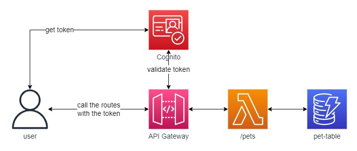
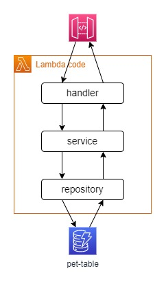
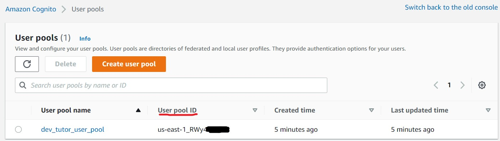
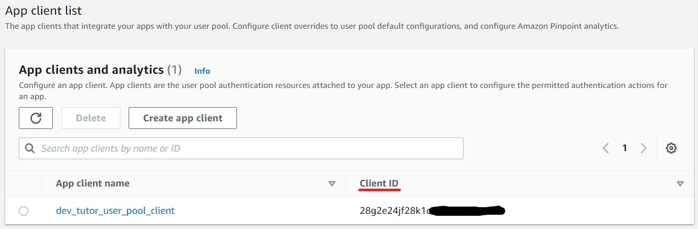
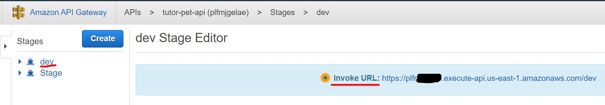

# **tutor-pet API**

Simple CRUD API written in **Go**, built using **AWS SAM** tool and using the **AWS'** infrastructure.

Macro architecture:\


Code architecture:\


## **Pre-Requisites**
1. Install the **Go** language.
2. Install the **make** utility tool.
2. Install **aws-cli**, follow the [official guide](https://docs.aws.amazon.com/cli/latest/userguide/cli-chap-install.html).
3. Install aws **sam-cli**, follow the [official guide](https://docs.aws.amazon.com/serverless-application-model/latest/developerguide/serverless-sam-cli-install.html).


## **How to Run**
### Locally:
Run the follow command:
```bash
make run-local
```
### On AWS:
1. Run the follow command:
    ```bash
    make deploy
    ```
2. Get the Cognito `user-pool-id` and Cognito user-pool `clint-id` on **AWS console**:
    
    
3. Run the following script to **add an user to the Cognito** `UserPool` and get a **token** to call the API *(remember to add the right values to the env vars before the command)*:
    ```bash
    chmod +x scripts/cognito_add_test_user.sh
    ```
    ```bash
    USER_POOL_ID= CLIENT_ID= USER_NAME=your@email.com TEMPORARY_PASSWORD=T3ST@go NEW_PASSWORD=T3ST@golang NAME="" FAMILY_NAME="" ./scripts/cognito_add_test_user.sh
    ```
4. After this command is possible to get a new token with the following commands:
    ```bash
    chmod +x scripts/cognito_get_token_test_user.sh
    ```
    ```bash
    USER_POOL_ID= CLIENT_ID= USER_NAME=your@email.com NEW_PASSWORD=T3ST@golang ./scripts/cognito_get_token_test_user.sh
    ```
5. Get the API URL
    

If completed successfully, user a tool like *curl* or *Postman* to test the API passing the **token** in the `Authorization` header.
You can also check the stack status inside AWS' console at *CloudFormation* service.

## **Call sample**
```bash
curl --request POST \
  --url https://11xxxxx1x1.execute-api.us-east-1.amazonaws.com/dev/pets \
  --header 'Authorization: Bearer token_here' \
  --header 'Content-Type: application/json' \
  --data '{
	"name": "Joca",
	"age": 4,
	"tutorID": 1234
}'
```

## **Folder Structure**
### **resources/**
This folder contains all the AWS resources used by the API, the files will be grouped together in the `base.yaml` file before the `sam deploy` action (there is a `build-template` script inside the `scripts` folder to put all the resources and the base template together, [see here](scripts/build-template/README.md)).
### **scripts/**
This folder has some useful scripts to help the development process
### **src/**
- **handlers**: This Folder contains the sub-folders where is the handler code for each lambda. Each AWS Lambda has its own folder and go file has the same name of the sub-folder.
- **models**: It is the folder where is the data model.
- **repositories**: Here we put the repositories for each model that we create.
- **services**: The services receive requests from the handler layer and get the data inside the repository.
- **types**: Here we can put DTOs (data transfer objects) for responses or requests.
- **utils**: Some useful code to avoid duplication.

## **Testing**
*TODO*
